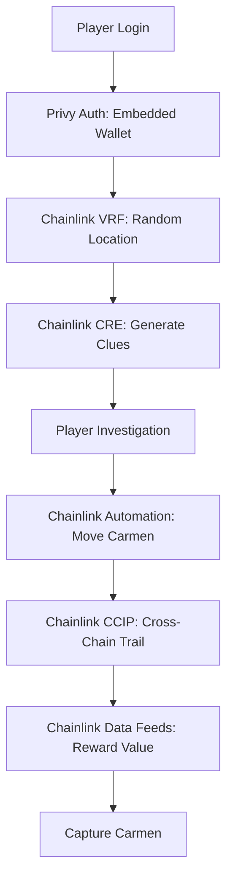

<p align="center">
  
</p>

<h1 align="center">Where in the Web3 World is Carmen Sandiego?</h1>

<h3 align="center">A Fully Decentralized Mystery Game Powered by Chainlink</h3>

<p align="center">
  <a href="https://chain.link/hackathon"></a>
  <a href="#chainlink-services"></a>
  <a href="#deployed-contracts"></a>
</p>

<p align="center">
  <strong>The first blockchain game demonstrating the full power of Chainlink's decentralized oracle network</strong>
</p>

---

## 🎯 The Challenge

**How do you create a truly decentralized game that is:**
- ✅ **Provably fair** (no centralized randomness)
- ✅ **Cross-chain** (multiple blockchains) 
- ✅ **Gas-free for players** (seamless UX)
- ✅ **Dynamic & intelligent** (AI-driven content)
- ✅ **Secure & private** (encrypted clues)

**Without Chainlink, this would be impossible.** Here's why:

---

## 🔗 Chainlink Services: Problems & Solutions

### 1️⃣ **Chainlink VRF v2.5 - Provably Fair Randomness**

**❌ Problem:** How do you randomly place Carmen across blockchains without a trusted centralized source?

**✅ Chainlink Solution:** VRF provides cryptographically provable randomness directly on-chain.

```solidity
// Without Chainlink: Centralized RNG (manipulable)
uint256 random = "centralized_server_api.getRandom()"; // ❌ Trust required

// With Chainlink VRF: Provably fair randomness
uint256 random = s_vrfCoordinator.requestRandomWords(); // ✅ Mathematically provable
```

**Impact:** Every mission location is unpredictable and verifiable by anyone.

---

### 2️⃣ **Chainlink CRE - Decentralized Game Engine**

**❌ Problem:** How do you run complex game logic (AI clues, cross-chain moves) without centralized servers?

**✅ Chainlink Solution:** CRE runs TypeScript/WASM workflows off-chain with on-chain results.

```typescript
// Without Chainlink: Centralized game server
const server = new GameServer(); // ❌ Single point of failure

// With Chainlink CRE: Decentralized computation
export async function main() {
  // Runs on DON nodes, results posted on-chain
  const encryptedClue = await generateEncryptedClue(playerPubKey);
  await emitClueGenerated(player, encryptedClue);
}
```

**Impact:** Game logic is decentralized, tamper-proof, and always available.

---

### 3️⃣ **Chainlink Data Feeds - Dynamic Reward Pricing**

**❌ Problem:** How do you maintain economic value across volatile crypto markets?

**✅ Chainlink Solution:** Real-time price feeds for dynamic reward calculations.

```solidity
// Without Chainlink: Static rewards
uint256 reward = 0.01 ether; // ❌ Value fluctuates wildly

// With Chainlink Data Feeds: Dynamic pricing
uint256 ethPrice = priceFeed.latestAnswer();
uint256 reward = (USD_TARGET * 1e18) / ethPrice; // ✅ Stable value
```

**Impact:** Rewards maintain consistent value regardless of market volatility.

---

### 4️⃣ **Chainlink CCIP - Cross-Chain Interoperability**

**❌ Problem:** How do you enable seamless cross-chain gameplay without bridges?

**✅ Chainlink Solution:** CCIP provides secure cross-chain messaging and token transfers.

```solidity
// Without Chainlink: Complex bridges
bridge.transfer(arbitrum, polygon, token); // ❌ Custodial, risky

// With Chainlink CCIP: Native cross-chain
ccip.send(polygon, player, message, tokens); // ✅ Non-custodial, secure
```

**Impact:** Carmen can move across chains seamlessly with players following her trail.

---

### 5️⃣ **Chainlink Automation - Scheduled Game Events**

**❌ Problem:** How do you trigger time-based game events without centralized cron jobs?

**✅ Chainlink Solution:** Automation triggers smart contract functions on schedule.

```solidity
// Without Chainlink: Centralized cron
cron.schedule('*/3 * * * *', moveCarmen); // ❌ Server dependency

// With Chainlink Automation: Decentralized scheduling
automation.register upkeep("move-carmen", interval, moveCarmen); // ✅ Decentralized
```

**Impact:** Carmen moves every 3 minutes reliably, creating urgency and dynamic gameplay.

---

## 🎮 How It Works: The Chainlink-Powered Flow



---

## 🚀 Quick Start

```bash
# 1. Clone and setup
git clone https://github.com/mtrn87/carmen-sandiego-onchain
cd carmen-sandiego-onchain

# 2. Install dependencies
npm run install:all

# 3. Configure environment
cp .env.example .env
# Edit .env with your API keys

# 4. Deploy contracts
npm run deploy

# 5. Start services
npm run dev
```

Visit `http://localhost:5173` and start hunting Carmen across blockchains!

---

## 📊 Project Architecture

| Component | Chainlink Service | Purpose |
|-----------|------------------|---------|
| **Game Logic** | CRE | Decentralized game engine |
| **Randomness** | VRF v2.5 | Provably fair location selection |
| **Economics** | Data Feeds | Dynamic reward pricing |
| **Multi-Chain** | CCIP | Cross-chain interoperability |
| **Timing** | Automation | Scheduled game events |

---

## 🎯 Why Chainlink is Essential

| Challenge | Without Chainlink | With Chainlink |
|-----------|------------------|----------------|
| **Fair Randomness** | Centralized RNG (manipulable) | VRF: Mathematically provable |
| **Game Logic** | Centralized servers (SPOF) | CRE: Decentralized computation |
| **Cross-Chain** | Risky bridges | CCIP: Secure messaging |
| **Market Volatility** | Fixed token amounts | Data Feeds: Dynamic pricing |
| **Scheduled Events** | Centralized cron jobs | Automation: Decentralized timing |

---

## Deployed Contracts

### Ethereum Sepolia (Hub — Chain ID: 11155111)

| Contract | Address | Etherscan |
|----------|---------|-----------|
| GameMaster | `0x826B5aCBE085C30C9F34A287D1fE543e2EAC56ce` | [View](https://sepolia.etherscan.io/address/0x826B5aCBE085C30C9F34A287D1fE543e2EAC56ce) |
| GameMasterProxy | `0xcbFD04229AB18f65F70242e676c292aE35188a4A` | [View](https://sepolia.etherscan.io/address/0xcbFD04229AB18f65F70242e676c292aE35188a4A) |
| PlayerRegistry | `0x9c0C0C6126e6E53a4fbd186674156420a356B69A` | [View](https://sepolia.etherscan.io/address/0x9c0C0C6126e6E53a4fbd186674156420a356B69A) |
| MissionNFT | `0x61F7fb92862e10d5290C16fC07Ea90fF260aee20` | [View](https://sepolia.etherscan.io/address/0x61F7fb92862e10d5290C16fC07Ea90fF260aee20) |

### Cross-Chain CityNodes

| City | Chain | Chain ID | Address |
|------|-------|----------|---------|
| Tokyo | Arbitrum Sepolia | 421614 | `0x6A906A00ca053Ec9Ff7844f2070C31E505c159A0` |
| Sydney | XDC Apothem | 51 | `0x47E25bFfCC00B2206a1B0A99284A6c447876C6A1` |

### Chainlink Infrastructure (Sepolia)

| Component | Address |
|-----------|---------|
| VRF Coordinator v2.5 | `0x9DdfaCa8183c41ad55329BdeeD9F6A8d53168B1B` |
| KeystoneForwarder | `0x15fC6ae953E024d975e77382eEeC56A9101f9F88` |
| ETH/USD Data Feed | `0x694AA1769357215DE4FAC081bf1f309aDC325306` |
| Deployer Wallet | `0xb19eE81581AE385F56D702d412D92d70fb65b9F7` |

---

## On-Chain Evidence & Transaction Proofs

> All transactions are verifiable on [Sepolia Etherscan](https://sepolia.etherscan.io). CRE simulation logs are stored in [`cre-workflows/logs/`](cre-workflows/logs/).

### CRE Workflow Simulations — Sepolia Transaction Hashes

Every CRE workflow was compiled to WASM and simulated against **real Sepolia on-chain state** using the CRE CLI. Each simulation reads a real transaction, decodes its event logs, and executes the full workflow logic (AI calls, encryption, on-chain reads/writes):

| # | Workflow | Sepolia TX Hash | Event | Log Index | Etherscan |
|---|----------|----------------|-------|-----------|-----------|
| 1 | **generate-briefing** | `0x3fba49f92846035e3c65e703af12b97`<br>`55c168287b9ada2f4e9cb749bb0019f0c` | `MissionStarted` | 1 | [View TX](https://sepolia.etherscan.io/tx/0x3fba49f92846035e3c65e703af12b9755c168287b9ada2f4e9cb749bb0019f0c) |
| 2 | **mission-start** | `0xafe53d52de5ced22ae861f84e37b5fb1`<br>`3323b20cc6973f45f6be3628c23f3f13` | `InvestigationSubmitted` | 0 | [View TX](https://sepolia.etherscan.io/tx/0xafe53d52de5ced22ae861f84e37b5fb13323b20cc6973f45f6be3628c23f3f13) |
| 3 | **generate-finale** | `0xb88e671b9b63cd67fd06c1ebb61cbb63`<br>`e30e919c61f882f26cd74eb941512494` | `CarmenCaptured` | 1 | [View TX](https://sepolia.etherscan.io/tx/0xb88e671b9b63cd67fd06c1ebb61cbb63e30e919c61f882f26cd74eb941512494) |
| 4 | **player-registration** | `0x19f9aa5b53dd277ccf5e064bf18e1551`<br>`25890dd71137117f9edacf3ca9899ee4` | `RegistrationRequested` | 0 | [View TX](https://sepolia.etherscan.io/tx/0x19f9aa5b53dd277ccf5e064bf18e155125890dd71137117f9edacf3ca9899ee4) |
| 5 | **player-check** | `0x6aecf68f4ffdbe2b3f0281ad3e8a30d5`<br>`2eec9f414f614c297f80be066a4a4038` | `PlayerCheckRequested` | 0 | [View TX](https://sepolia.etherscan.io/tx/0x6aecf68f4ffdbe2b3f0281ad3e8a30d52eec9f414f614c297f80be066a4a4038) |
| 6 | **carmen-moves** | Cron-triggered (no TX input) | `CronCapability` | — | N/A — reads `getActiveMissionIds()` on-chain |

### What Each Simulation Proves (From CRE CLI Logs)

<details>
<summary><strong>generate-briefing</strong> — AI + Data Feed + ECIES inside WASM</summary>

```
[Chainlink Data Feed] ETH/USD = $2137.09 (round=18446744073709582665)
[Chainlink Data Feed] Contract: 0x694AA1769357215DE4FAC081bf1f309aDC325306 (Sepolia)
MissionStarted: mission=12, player=0xb19eE81581AE385F56D702d412D92d70fb65b9F7
TargetHash: 0xcc00fc51...bd0cb4, salt: 0xdf21a432...f2531
Scenario: "The DAO Treasury Drain"
Calling Groq LLM API for dynamic briefing...
AI briefing generated via Groq/LLaMA (973 chars)
Opening clue encrypted (2132 hex chars)
Encrypted opening clue delivered on-chain!
```
**Chainlink services used:** CRE (WASM execution), Data Feeds (ETH/USD live price), VRF (salt from commit-reveal), Keystone Forwarder (signed report delivery)
</details>

<details>
<summary><strong>mission-start</strong> — Commit-reveal brute-force + clue engine</summary>

```
Investigation: mission=12, player=0xb19eE81581AE385F56D702d412D92d70fb65b9F7, chainId=84532
Salt: 0xdf21a432e6cfb8be02f00d64163cb9f40e3895ca010fd0db3ebd1d1ed35f2531
Carmen is in city: 84532
Player investigated 84532, correct=true
Clue strength: 61 (threshold=65, correct=true)
Clue encrypted (668 hex chars)
Clues: 4 on-chain + 1 new = 5 total (need 3)
CAPTURE! Player found Carmen in city 84532 with 5 clues.
Carmen captured! Mission complete!
```
**Chainlink services used:** CRE (commit-reveal verification, clue selection), VRF (salt for keccak256 hash matching), Keystone Forwarder (clue + capture delivery)
</details>

<details>
<summary><strong>generate-finale</strong> — SVG trophy + ERC-721 on-chain NFT</summary>

```
CarmenCaptured: mission=12, player=0xb19eE81581AE385F56D702d412D92d70fb65b9F7, blocks=14, reward=100
Captured in: Paris (Base Sepolia)
Scenario: "The DAO Treasury Drain", Tier: GOLD
SVG trophy generated (3600 chars)
Token URI built (9405 chars)
Trophy NFT metadata set for Mission #12! (GOLD rank)
```
**Chainlink services used:** CRE (SVG generation, metadata encoding), Keystone Forwarder (`ACTION_SET_TOKEN_URI` delivery to MissionNFT ERC-721)
</details>

<details>
<summary><strong>player-registration</strong> — Gasless onboarding via CRE</summary>

```
Registry: 0x9c0C0C6126e6E53a4fbd186674156420a356B69A
Player: 0xb19eE81581AE385F56D702d412D92d70fb65b9F7
Nickname: HackatonDemo
Nickname "HackatonDemo" available: true
```
**Chainlink services used:** CRE (nickname validation, gasless relay), Keystone Forwarder (registration delivery)
</details>

<details>
<summary><strong>player-check</strong> — On-chain player verification</summary>

```
Player: 0xb19eE81581AE385F56D702d412D92d70fb65b9F7
Exists: true, Nickname: " ", Rank: 320
```
**Chainlink services used:** CRE (on-chain read via EVMClient), Keystone Forwarder (check result delivery)
</details>

<details>
<summary><strong>carmen-moves</strong> — Autonomous cron via CronCapability</summary>

```
=== Carmen Moves — Cron Trigger ===
Active missions: [] (0 total)
No active missions, nothing to do
```
**Chainlink services used:** CRE CronCapability (Automation — scheduled every 3 min), EVMClient (`getActiveMissionIds()` on-chain read)
</details>

### Chainlink VRF v2.5 — On-Chain Configuration

| Parameter | Value | Etherscan |
|-----------|-------|-----------|
| VRF Coordinator | `0x9DdfaCa8183c41ad55329BdeeD9F6A8d53168B1B` | [View](https://sepolia.etherscan.io/address/0x9DdfaCa8183c41ad55329BdeeD9F6A8d53168B1B) |
| VRF Subscription ID | `80568780173052067359480512728291582443404092976312047101726106109476569951281` | [View on vrf.chain.link](https://vrf.chain.link) |
| VRF Key Hash | `0x787d74caea10b2b357790d5b5247c2f63d1d91572a9846f780606e4d953677ae` | Sepolia 150 gwei lane |
| Consumer Contract | `0x826B5aCBE085C30C9F34A287D1fE543e2EAC56ce` (GameMaster) | [View](https://sepolia.etherscan.io/address/0x826B5aCBE085C30C9F34A287D1fE543e2EAC56ce) |

### Commit-Reveal Cryptographic Proof (Mission #12)

```
Salt (from VRF):  0xdf21a432e6cfb8be02f00d64163cb9f40e3895ca010fd0db3ebd1d1ed35f2531
TargetHash:       0xcc00fc51f887a40dc049a569f0be21ea4874a417cde8336a96ca9ed850bd0cb4
Verification:     keccak256(abi.encodePacked(84532, salt)) == targetHash  ✓
Carmen's city:    84532 (Base Sepolia = Paris)
```

### End-to-End Demo Results (Mission #11 — Live Sepolia Testnet)

| Phase | Duration | Chainlink Service | Details |
|-------|----------|-------------------|---------|
| VRF Fulfillment | ~77s | **VRF v2.5** | `requestRandomWords()` → DON → `fulfillRandomWords()` with salt |
| Briefing Generation | ~4s | **CRE** + Groq LLM | Noir-style mission narrative, ECIES-encrypted |
| Investigation 1 (Tokyo) | — | **CRE** | Wrong city — encrypted clue delivered |
| Investigation 2 (Sydney) | — | **CRE** | Wrong city — encrypted clue delivered |
| Investigation 3 (Tokyo) | — | **CRE** + **Automation** | Carmen found! (`carmen-moves` relocated Paris→Tokyo) |
| Capture + NFT Mint | ~45s | **CRE** + ERC-721 | GOLD rank, 13 blocks, NFT #10 with on-chain SVG |
| **Total Runtime** | **4m 2s** | **5 services** | Real testnet, real Chainlink, zero mocks |

### CRE CLI Simulation Batch Results

All 6 workflows compiled and simulated successfully across **10+ confirmed batch runs**:

| Batch Timestamp | Result | Log File |
|-----------------|--------|----------|
| `2026-03-04T20:28:23Z` | **6/6 PASSED** | [`20260304_202823_SUMMARY.log`](cre-workflows/logs/20260304_202823_SUMMARY.log) |
| `2026-03-04T20:09:48Z` | **6/6 PASSED** | [`20260304_200948_SUMMARY.log`](cre-workflows/logs/20260304_200948_SUMMARY.log) |
| `2026-03-04T19:52:07Z` | **6/6 PASSED** | [`20260304_195207_SUMMARY.log`](cre-workflows/logs/20260304_195207_SUMMARY.log) |
| `2026-03-03T20:58:07Z` | **6/6 PASSED** | [`20260303_205807_SUMMARY.log`](cre-workflows/logs/20260303_205807_SUMMARY.log) |
| `2026-03-03T20:49:04Z` | **6/6 PASSED** | [`20260303_204904_SUMMARY.log`](cre-workflows/logs/20260303_204904_SUMMARY.log) |
| `2026-03-03T20:46:46Z` | **6/6 PASSED** | [`20260303_204646_SUMMARY.log`](cre-workflows/logs/20260303_204646_SUMMARY.log) |
| `2026-03-03T19:50:00Z` | **6/6 PASSED** | [`20260303_195000_SUMMARY.log`](cre-workflows/logs/20260303_195000_SUMMARY.log) |
| `2026-03-03T19:45:51Z` | **6/6 PASSED** | [`20260303_194551_SUMMARY.log`](cre-workflows/logs/20260303_194551_SUMMARY.log) |
| `2026-03-03T19:33:34Z` | **6/6 PASSED** | [`20260303_193334_SUMMARY.log`](cre-workflows/logs/20260303_193334_SUMMARY.log) |
| `2026-03-03T18:50:50Z` | **6/6 PASSED** | [`20260303_185050_SUMMARY.log`](cre-workflows/logs/20260303_185050_SUMMARY.log) |

### Test Suite

```
Contracts:  65 tests passing  (Hardhat + VRF/DataFeed/CCIP mocks)
Frontend:   59 tests passing  (Vitest)
CRE:        6/6 workflows     compile + simulate (10 batch runs)
```

---

## 📚 Documentation

- [📖 Documentation Index](docs/INDEX.md)
- [🎮 Game Flow](GAME_FLOW.md)
- [🔧 Setup Guide](SETUP.md)
- [🔒 Security Audit](docs/SECURITY_AUDIT.md)
- [🌐 Deployment Guide](docs/DEPLOYMENT_GUIDE.md)

---

## 🤝 Contributing

We welcome contributions! Please see our [contributing guidelines](CONTRIBUTING.md) for details.

---

## 📄 License

This project is licensed under the MIT License - see the [LICENSE](LICENSE) file for details.

---

<p align="center">
  <strong>Built with ❤️ using the full power of Chainlink's decentralized oracle network</strong>
</p>

<p align="center">
  <em>"Without Chainlink, this game would be impossible. With Chainlink, it's unstoppable."</em>
</p>
