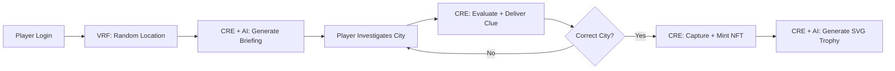

<p align="center">
  
</p>

<h1 align="center">Where in the Web3 World is Carmen Sandiego?</h1>

<h3 align="center">A Fully Decentralized Mystery Game — CRE + AI on Chainlink</h3>

<p align="center">
  <a href="https://chain.link/hackathon"></a>
  <a href="#cre--ai--the-decentralized-game-engine"></a>
  <a href="#deployed-contracts--on-chain-evidence"></a>
</p>

<p align="center">
  <a href="#on-chain-transaction-proofs"></a>
  <a href="#cre-cli-simulation-batch-results"></a>
  <a href="#test-suite"></a>
</p>

<p align="center">
  <strong>The first blockchain game where the entire game brain — including AI content generation — runs decentralized inside Chainlink CRE</strong>
</p>

<p align="center">
  <a href="https://youtu.be/r7PBb7fs9vU">
    
  </a>
</p>
<p align="center">
  <a href="https://youtu.be/r7PBb7fs9vU"><strong>▶ Watch the Project Explanation</strong></a>
</p>

---

## The Problem

Every blockchain game today has the same dirty secret: the fun parts — generating content, evaluating player actions, updating game state — all run on a **centralized server**. The smart contract is just a scoreboard. One server goes down, one company pulls the plug, and the game is gone forever.

There's a deeper problem: **who decides if your answer is right?** A backend you can't audit. An API you have to trust. And when a game uses AI to generate content — who controls the prompt? Who verifies the output?

**That's not Web3 — that's Web2 with a wallet.**

We asked: **what if the AI itself ran inside a decentralized oracle network?**

---

## CRE + AI — The Decentralized Game Engine

**We built 7 CRE workflows (~3,578 lines of TypeScript).** Each is an independent module that compiles to WASM and executes inside the Chainlink DON. All nodes run identical bytecode, produce identical output (temperature=0), reach consensus, and deliver threshold-signed reports on-chain.

### How AI Runs Inside CRE

```typescript
// generate-briefing/main.ts — runs on EVERY DON node
export async function main(runtime: CRERuntime) {
  // 1. Read live ETH/USD price from Chainlink Data Feed (on-chain read inside WASM)
  const ethPrice = await evmClient.callContract(runtime, {
    call: encodeCallMsg({ to: DATA_FEED_ADDRESS, data: latestRoundDataSelector })
  });

  // 2. Call Groq LLaMA 3.3-70b via HTTPClient (AI inside decentralized compute)
  const briefing = await httpClient.sendRequest(runtime, {
    url: "https://api.groq.com/openai/v1/chat/completions",
    body: JSON.stringify({ model: "llama-3.3-70b-versatile", temperature: 0, messages: [...] })
  }).result();

  // 3. Encrypt with player's secp256k1 public key (end-to-end privacy)
  const encrypted = eciesEncrypt(playerPublicKey, briefing);

  // 4. Deliver threshold-signed report on-chain via KeystoneForwarder
  return writeReport(runtime, [{ abi, data: encrypted }]);
}
```

**In one workflow execution:** live blockchain data + AI generation + end-to-end encryption + on-chain delivery. All inside WASM. All decentralized.

### The 7 CRE Workflows

| # | Workflow | Trigger | AI/LLM | What It Does |
|---|----------|---------|--------|--------------|
| 1 | **generate-briefing** | `MissionStarted` event | Groq LLaMA 3.3-70b | Reads Data Feed, calls LLM, ECIES-encrypts briefing, delivers on-chain |
| 2 | **mission-start** | `InvestigationSubmitted` event | — | Brute-forces commit-reveal hash, evaluates guess, generates encrypted clue |
| 3 | **generate-finale** | `CarmenCaptured` event | Groq LLaMA 3.3-70b | Generates SVG trophy + ERC-721 metadata, sets token URI on-chain |
| 4 | **carmen-moves** | CronCapability (every 3 min) | — | Reads active missions, relocates Carmen using targetHash entropy |
| 5 | **player-registration** | `RegistrationRequested` event | — | Validates nickname, registers player gaslessly |
| 6 | **player-check** | `PlayerCheckRequested` event | — | Verifies player exists and returns rank |
| 7 | **citynode-resolver** | `ClueRequested` / `DossierRequested` / `CaptureRequested` | — | Resolves cross-chain CityNode requests back to GameMaster on Sepolia |

### CRE Capabilities Used

| Capability | Where | Purpose |
|------------|-------|---------|
| **EVMClient.callContract** | All 7 workflows | Read on-chain state (missions, players, cities, Data Feed) |
| **HTTPClient.sendRequest** | generate-briefing, generate-finale | Call Groq LLaMA 3.3-70b for AI content |
| **writeReport** | All 7 workflows | Deliver threshold-signed results on-chain |
| **CronCapability** | carmen-moves | Autonomous scheduled execution (every 3 min) |
| **LogTrigger** | 6 workflows | React to on-chain events |

### Determinism for DON Consensus

AI outputs must be **identical across all DON nodes** for consensus. We achieve this with:
- `temperature: 0` on all LLM calls — deterministic output
- `@noble/curves v1.x` for ECIES — pinned because v2.x breaks CRE WASM compiler
- Scenario-based clue pools with deterministic strength scoring
- All randomness derived from VRF salt (on-chain, verifiable)

---

## Supporting Chainlink Services

CRE is the core, but it's powered by the full Chainlink stack:

| Service | Role | Integration Point |
|---------|------|-------------------|
| **VRF v2.5** | Provably fair randomness | `fulfillRandomWords()` → salt → `targetHash = keccak256(chainId, salt)` |
| **Data Feeds** | Live ETH/USD pricing | CRE reads aggregator inside WASM via `EVMClient.callContract` |
| **CCIP** | Cross-chain messaging | Carmen movement notifications to CityNode contracts |
| **Automation** | Scheduled events | `carmen-moves` via CronCapability (every 3 min) |
| **Keystone Forwarder** | Report delivery | All CRE workflow outputs delivered with threshold signatures |

---

## Game Flow



---

## Deployed Contracts & On-Chain Evidence

### Ethereum Sepolia — Hub (Chain ID: 11155111)

| Contract | Address | Etherscan | TX Count |
|----------|---------|-----------|----------|
| **GameMaster** | `0x826B5aCBE085C30C9F34A287D1fE543e2EAC56ce` | [View](https://sepolia.etherscan.io/address/0x826B5aCBE085C30C9F34A287D1fE543e2EAC56ce) | 409+ |
| **GameMasterProxy** | `0xcbFD04229AB18f65F70242e676c292aE35188a4A` | [View](https://sepolia.etherscan.io/address/0xcbFD04229AB18f65F70242e676c292aE35188a4A) | — |
| **PlayerRegistry** | `0x9c0C0C6126e6E53a4fbd186674156420a356B69A` | [View](https://sepolia.etherscan.io/address/0x9c0C0C6126e6E53a4fbd186674156420a356B69A) | — |
| **MissionNFT** (ERC-721) | `0x61F7fb92862e10d5290C16fC07Ea90fF260aee20` | [View](https://sepolia.etherscan.io/address/0x61F7fb92862e10d5290C16fC07Ea90fF260aee20) | — |

### Cross-Chain CityNodes

| City | Network | Chain ID | Address |
|------|---------|----------|---------|
| Tokyo | Arbitrum Sepolia | 421614 | `0x6A906A00ca053Ec9Ff7844f2070C31E505c159A0` |
| Sydney | XDC Apothem | 51 | `0x47E25bFfCC00B2206a1B0A99284A6c447876C6A1` |

### Chainlink Infrastructure

| Component | Address | Etherscan |
|-----------|---------|-----------|
| VRF Coordinator v2.5 | `0x9DdfaCa8183c41ad55329BdeeD9F6A8d53168B1B` | [View](https://sepolia.etherscan.io/address/0x9DdfaCa8183c41ad55329BdeeD9F6A8d53168B1B) |
| KeystoneForwarder | `0x15fC6ae953E024d975e77382eEeC56A9101f9F88` | [View](https://sepolia.etherscan.io/address/0x15fC6ae953E024d975e77382eEeC56A9101f9F88) |
| ETH/USD Data Feed | `0x694AA1769357215DE4FAC081bf1f309aDC325306` | [View](https://sepolia.etherscan.io/address/0x694AA1769357215DE4FAC081bf1f309aDC325306) |

| Parameter | Value |
|-----------|-------|
| VRF Subscription ID | `80568780173052067359480512728291582443404092976312047101726106109476569951281` |
| VRF Key Hash | `0x787d74caea10b2b357790d5b5247c2f63d1d91572a9846f780606e4d953677ae` |
| Deployer | `0xb19eE81581AE385F56D702d412D92d70fb65b9F7` |

---

## On-Chain Transaction Proofs

> All transactions verified on [Sepolia Etherscan](https://sepolia.etherscan.io) — Status: **Success** for all 5.

Each CRE workflow was compiled to WASM and simulated against these **real Sepolia transactions** using the CRE CLI:

| # | Workflow | TX Hash | Event | Contract | Etherscan |
|---|----------|---------|-------|----------|-----------|
| 1 | **generate-briefing** | `0x3fba49...019f0c` | `MissionStarted` | GameMaster | [View TX](https://sepolia.etherscan.io/tx/0x3fba49f92846035e3c65e703af12b9755c168287b9ada2f4e9cb749bb0019f0c) |
| 2 | **mission-start** | `0xafe53d...3f3f13` | `InvestigationSubmitted` | GameMaster | [View TX](https://sepolia.etherscan.io/tx/0xafe53d52de5ced22ae861f84e37b5fb13323b20cc6973f45f6be3628c23f3f13) |
| 3 | **generate-finale** | `0xb88e67...512494` | `CarmenCaptured` + NFT Mint | GameMaster + MissionNFT | [View TX](https://sepolia.etherscan.io/tx/0xb88e671b9b63cd67fd06c1ebb61cbb63e30e919c61f882f26cd74eb941512494) |
| 4 | **player-registration** | `0x19f9aa...99ee4` | `RegistrationRequested` | PlayerRegistry | [View TX](https://sepolia.etherscan.io/tx/0x19f9aa5b53dd277ccf5e064bf18e155125890dd71137117f9edacf3ca9899ee4) |
| 5 | **player-check** | `0x6aecf6...a4038` | `PlayerCheckRequested` | PlayerRegistry | [View TX](https://sepolia.etherscan.io/tx/0x6aecf68f4ffdbe2b3f0281ad3e8a30d52eec9f414f614c297f80be066a4a4038) |
| 6 | **carmen-moves** | Cron (no TX input) | `CronCapability` | GameMaster | N/A — reads `getActiveMissionIds()` |

<details open>
<summary><strong>TX #1 — startMission()</strong> — VRF request + CRE AI briefing</summary>

- **From:** `0xb19eE81581AE385F56D702d412D92d70fb65b9F7`
- **To:** GameMaster (`0x826B5aCBE085C30C9F34A287D1fE543e2EAC56ce`)
- **Gas Used:** 258,756
- **Events:** `RandomWordsRequested` (VRF Coordinator) + `MissionStarted` (mission=12)
- **CRE reads:** mission ID, player address, target hash, salt, player public key
- **CRE calls:** Groq LLaMA 3.3-70b (temperature=0) for noir-style mission briefing
- **CRE encrypts:** ECIES secp256k1 with player's on-chain public key
- **CRE delivers:** encrypted briefing (2,132 hex chars) via signed report
</details>

<details>
<summary><strong>TX #2 — submitInvestigation()</strong> — CRE commit-reveal + clue engine</summary>

- **From:** `0xb19eE81581AE385F56D702d412D92d70fb65b9F7`
- **To:** GameMaster (`0x826B5aCBE085C30C9F34A287D1fE543e2EAC56ce`)
- **Gas Used:** 45,543
- **Events:** `InvestigationSubmitted` (chainId=84532)
- **CRE computes:** `keccak256(84532, salt) == targetHash` → **MATCH** (Carmen in Paris/Base Sepolia)
- **CRE outputs:** encrypted clue (668 hex chars) + capture trigger (5 clues collected)
</details>

<details>
<summary><strong>TX #3 — Carmen captured + ERC-721 NFT minted</strong></summary>

- **From:** `0xb19eE81581AE385F56D702d412D92d70fb65b9F7`
- **To:** GameMaster → MissionNFT
- **Events (4):** `CarmenCaptured` + game state update + ERC-721 `Transfer(0x0 → player, tokenId=11)` + token metadata set
- **CRE generates:** SVG trophy (3,600 chars) + ERC-721 metadata (9,405 chars) — fully on-chain, no IPFS
- **CRE calls:** Groq LLaMA for victory narrative (with enriched template fallback)
</details>

<details>
<summary><strong>TX #4 — requestRegistration("HackatonDemo")</strong></summary>

- **To:** PlayerRegistry (`0x9c0C0C6126e6E53a4fbd186674156420a356B69A`)
- **Events:** `RegistrationRequested`
- **CRE validates:** nickname availability, registers player gaslessly
</details>

<details>
<summary><strong>TX #5 — checkPlayerExists()</strong></summary>

- **To:** PlayerRegistry (`0x9c0C0C6126e6E53a4fbd186674156420a356B69A`)
- **Gas Used:** 22,971
- **Events:** `PlayerCheckRequested`
- **CRE reads:** player exists=true, rank=320
</details>

### Commit-Reveal Cryptographic Proof (Mission #12)

```
Salt (from VRF):  0xdf21a432e6cfb8be02f00d64163cb9f40e3895ca010fd0db3ebd1d1ed35f2531
TargetHash:       0xcc00fc51f887a40dc049a569f0be21ea4874a417cde8336a96ca9ed850bd0cb4
Verification:     keccak256(abi.encodePacked(84532, salt)) == targetHash  ✓
Carmen's city:    84532 (Base Sepolia = Paris)
```

---

## End-to-End Demo (Mission #11 — Live Sepolia)

Full game loop on live testnet — real VRF, real CRE oracle, real AI, zero mocks:

| Phase | Time | Service | Result |
|-------|------|---------|--------|
| VRF Fulfillment | ~77s | VRF v2.5 | `requestRandomWords()` → DON → `fulfillRandomWords()` |
| Briefing | ~4s | **CRE + Groq LLM** | AI-generated noir briefing, ECIES-encrypted |
| Investigation 1 | — | **CRE** | Tokyo — wrong city, encrypted clue delivered |
| Investigation 2 | — | **CRE** | Sydney — wrong city, encrypted clue delivered |
| Investigation 3 | — | **CRE** + Automation | Tokyo — correct! (carmen-moves relocated Paris→Tokyo) |
| Capture + NFT | ~45s | **CRE + AI** | GOLD rank, 13 blocks, NFT #10 with on-chain SVG |
| **Total** | **4m 2s** | **CRE + AI + VRF** | End-to-end on real Sepolia |

---

## CRE CLI Simulation Batch Results

All 7 workflows compiled to WASM and simulated successfully — **10 confirmed batch runs** (6 per batch via simulate-all.sh + citynode-resolver separately):

| Date | Time | Result | Log |
|------|------|--------|-----|
| Mar 4 | 20:28 | **6/6 PASSED** | [`SUMMARY`](cre-workflows/logs/20260304_202823_SUMMARY.log) |
| Mar 4 | 20:09 | **6/6 PASSED** | [`SUMMARY`](cre-workflows/logs/20260304_200948_SUMMARY.log) |
| Mar 4 | 19:52 | **6/6 PASSED** | [`SUMMARY`](cre-workflows/logs/20260304_195207_SUMMARY.log) |
| Mar 3 | 20:58 | **6/6 PASSED** | [`SUMMARY`](cre-workflows/logs/20260303_205807_SUMMARY.log) |
| Mar 3 | 20:49 | **6/6 PASSED** | [`SUMMARY`](cre-workflows/logs/20260303_204904_SUMMARY.log) |
| Mar 3 | 20:46 | **6/6 PASSED** | [`SUMMARY`](cre-workflows/logs/20260303_204646_SUMMARY.log) |
| Mar 3 | 19:50 | **6/6 PASSED** | [`SUMMARY`](cre-workflows/logs/20260303_195000_SUMMARY.log) |
| Mar 3 | 19:45 | **6/6 PASSED** | [`SUMMARY`](cre-workflows/logs/20260303_194551_SUMMARY.log) |
| Mar 3 | 19:33 | **6/6 PASSED** | [`SUMMARY`](cre-workflows/logs/20260303_193334_SUMMARY.log) |
| Mar 3 | 18:50 | **6/6 PASSED** | [`SUMMARY`](cre-workflows/logs/20260303_185050_SUMMARY.log) |

---

## Test Suite

```
Smart Contracts    65 tests passing    Hardhat + VRF/DataFeed/CCIP mocks
Frontend           59 tests passing    Vitest
CRE Workflows      7/7 compile + simulate    10 batch runs, all green
```

---

## Quick Start

```bash
# Clone
git clone https://github.com/mtrn87/carmen-sandiego-onchain
cd carmen-sandiego-onchain

# Smart Contracts
cd contracts && npm install && npx hardhat compile && npx hardhat test

# CRE Workflows (requires CRE CLI + Bun)
cd cre-workflows && bash simulate-all.sh

# Frontend
cd frontend && npm install && npm run dev
```

---

## Tech Stack

| Layer | Technology |
|-------|------------|
| CRE Workflows | TypeScript → WASM · 7 workflows · ~3,578 lines · Chainlink CRE CLI |
| AI | Groq LLaMA 3.3-70b inside CRE WASM (temperature=0 for DON consensus) |
| Encryption | ECIES secp256k1 (end-to-end clue privacy inside CRE) |
| Smart Contracts | Solidity 0.8.24 · Hardhat · OpenZeppelin 5.x |
| Blockchain | Sepolia · Arbitrum Sepolia · Base Sepolia · XDC Apothem |
| Randomness | Chainlink VRF v2.5 (native ETH) |
| Pricing | Chainlink Data Feeds (ETH/USD) |
| Cross-Chain | Chainlink CCIP |
| Scheduling | Chainlink CronCapability (Automation) |
| Frontend | React 19 · Vite 7 · Zustand · ethers.js v6 |
| Auth | Privy (embedded wallet) |
| NFTs | ERC-721 with on-chain SVG data URIs |

---

## Project Structure

```
carmen-sandiego-onchain/
├── cre-workflows/                 # CRE — TypeScript → WASM (CORE)
│   ├── generate-briefing/         # AI briefing + Data Feed + ECIES
│   ├── mission-start/             # Clue engine + commit-reveal
│   ├── generate-finale/           # AI victory + SVG trophy + ERC-721
│   ├── carmen-moves/              # Cron: relocate Carmen every 3 min
│   ├── player-registration/       # Gasless onboarding
│   ├── player-check/              # Player verification
│   ├── citynode-resolver/         # Cross-chain CityNode request resolver
│   ├── simulate-all.sh            # Run all simulations
│   └── logs/                      # Timestamped simulation evidence
│
├── contracts/                     # Solidity — Hardhat
│   ├── src/GameMaster.sol         # VRF 2.5 + commit-reveal + CRE callbacks
│   ├── src/GameMasterProxy.sol    # KeystoneForwarder receiver
│   ├── src/PlayerRegistry.sol     # Player profiles + gasless registration
│   ├── src/CityNode.sol           # Per-chain investigation contracts
│   ├── src/MissionNFT.sol         # ERC-721 on-chain SVG trophies
│   └── test/                      # 65 tests
│
├── frontend/                      # React 19 + Vite 7
│   ├── src/services/              # Contract + CRE + relay services
│   ├── src/store/                 # Zustand game state
│   └── src/utils/ecies.js         # ECIES decryption
│
└── docs/                          # Technical documentation
```

---

## Chainlink Usage — Source Code Links

Every file in the project that integrates a Chainlink service:

### Smart Contracts (Solidity)

| File | Chainlink Service | What It Does |
|------|-------------------|-------------|
| [`GameMaster.sol`](contracts/src/GameMaster.sol) | **VRF v2.5**, **CCIP**, **Data Feeds** | `VRFConsumerBaseV2Plus` inheritance, `requestRandomWords()`, `fulfillRandomWords()`, CCIP Router `ccipSend()`, AggregatorV3 price reads |
| [`GameMasterProxy.sol`](contracts/src/GameMasterProxy.sol) | **CRE (KeystoneForwarder)** | Receives threshold-signed CRE reports via `ReceiverTemplate`, routes 11 action types to GameMaster |
| [`CityNode.sol`](contracts/src/CityNode.sol) | **CCIP** | `CCIPReceiver` inheritance, `_ccipReceive()` for cross-chain Carmen location updates |
| [`CCIPReceiver.sol`](contracts/src/CCIPReceiver.sol) | **CCIP** | Base contract for receiving CCIP messages, Router validation |
| [`interfaces/ICCIPRouter.sol`](contracts/src/interfaces/ICCIPRouter.sol) | **CCIP** | `IRouterClient` and `Client.Any2EVMMessage` / `EVM2AnyMessage` type definitions |
| [`interfaces/IGameMaster.sol`](contracts/src/interfaces/IGameMaster.sol) | **VRF**, **CCIP** | Interface declaring VRF + CCIP function signatures |
| [`mocks/VRFCoordinatorV2PlusMock.sol`](contracts/src/mocks/VRFCoordinatorV2PlusMock.sol) | **VRF v2.5** | Custom VRF Coordinator mock (OZ 5.x compatible) |
| [`mocks/MockAggregatorV3.sol`](contracts/src/mocks/MockAggregatorV3.sol) | **Data Feeds** | Mock `AggregatorV3Interface` for local testing |
| [`mocks/MockCCIPRouter.sol`](contracts/src/mocks/MockCCIPRouter.sol) | **CCIP** | Mock CCIP Router for local testing |

### CRE Workflows (TypeScript → WASM)

| File | Chainlink Capabilities | What It Does |
|------|----------------------|-------------|
| [`generate-briefing/main.ts`](cre-workflows/generate-briefing/main.ts) | **EVMClient**, **HTTPClient**, **writeReport**, **LogTrigger** | Reads Data Feed price, calls Groq LLaMA, ECIES-encrypts, delivers on-chain |
| [`mission-start/main.ts`](cre-workflows/mission-start/main.ts) | **EVMClient**, **writeReport**, **LogTrigger** | Brute-forces commit-reveal hash, generates encrypted clues, delivers wallet fragments |
| [`generate-finale/main.ts`](cre-workflows/generate-finale/main.ts) | **EVMClient**, **HTTPClient**, **writeReport**, **LogTrigger** | AI trophy + SVG generation, ERC-721 metadata, on-chain delivery |
| [`carmen-moves/main.ts`](cre-workflows/carmen-moves/main.ts) | **EVMClient**, **writeReport**, **CronCapability** | Reads active missions, relocates Carmen, triggers CCIP broadcast |
| [`player-registration/main.ts`](cre-workflows/player-registration/main.ts) | **EVMClient**, **writeReport**, **LogTrigger** | Validates and registers players gaslessly |
| [`player-check/main.ts`](cre-workflows/player-check/main.ts) | **EVMClient**, **writeReport**, **LogTrigger** | Verifies player status and rank |
| [`citynode-resolver/main.ts`](cre-workflows/citynode-resolver/main.ts) | **EVMClient**, **writeReport**, **LogTrigger** | Resolves cross-chain CityNode requests back to GameMaster |

### Tests

| File | Chainlink Service Tested |
|------|-------------------------|
| [`GameMaster.test.ts`](contracts/test/GameMaster.test.ts) | VRF v2.5, CCIP, Data Feeds |
| [`GameMaster.e2e.test.ts`](contracts/test/GameMaster.e2e.test.ts) | VRF v2.5, CCIP, KeystoneForwarder |
| [`GameMasterProxy.test.ts`](contracts/test/GameMasterProxy.test.ts) | CRE report delivery via KeystoneForwarder |
| [`CityNode.test.ts`](contracts/test/CityNode.test.ts) | CCIP receive + cross-chain state |

### Demo Scripts

| File | Chainlink Service |
|------|-------------------|
| [`scripts/cre-responder.ts`](contracts/scripts/cre-responder.ts) | CRE oracle simulation (VRF, CCIP, KeystoneForwarder) |
| [`scripts/demo-testnet.ts`](contracts/scripts/demo-testnet.ts) | End-to-end game flow (VRF, CRE) |
| [`scripts/deploy-all.ts`](contracts/scripts/deploy-all.ts) | VRF subscription, CCIP Router setup, KeystoneForwarder config |
| [`scripts/deploy-citynode.ts`](contracts/scripts/deploy-citynode.ts) | CCIP Router configuration per chain |

---

## Documentation

| Document | Description |
|----------|-------------|
| [Documentation Index](docs/INDEX.md) | Complete navigation guide |
| [**CRE Workflows README**](cre-workflows/README.md) | All 7 CRE workflows — architecture, code, simulation, gotchas |
| [Chainlink Technical Deep Dive](docs/CHAINLINK_TECHNICAL_DEEP_DIVE.md) | How CRE + AI and each Chainlink service is used |
| [Problems & Solutions](docs/PROBLEMS_AND_SOLUTIONS.md) | CRE WASM gotchas and how we solved them |
| [System Diagrams](docs/SYSTEM_DIAGRAMS.md) | Visual architecture and flow diagrams |
| [Game Flow](GAME_FLOW.md) | 9-phase game flow |
| [Setup Guide](SETUP.md) | Full deployment instructions |
| [Deployment Guide](docs/DEPLOYMENT_GUIDE.md) | Multi-chain deployment steps |
| [Security Audit](docs/SECURITY_AUDIT.md) | Smart contract security analysis |

---

## License

MIT

---

<p align="center">
  <strong>Built for the Convergence | Chainlink Hackathon</strong>
</p>
<p align="center">
  <em>The game that can't be shut down.</em>
</p>
