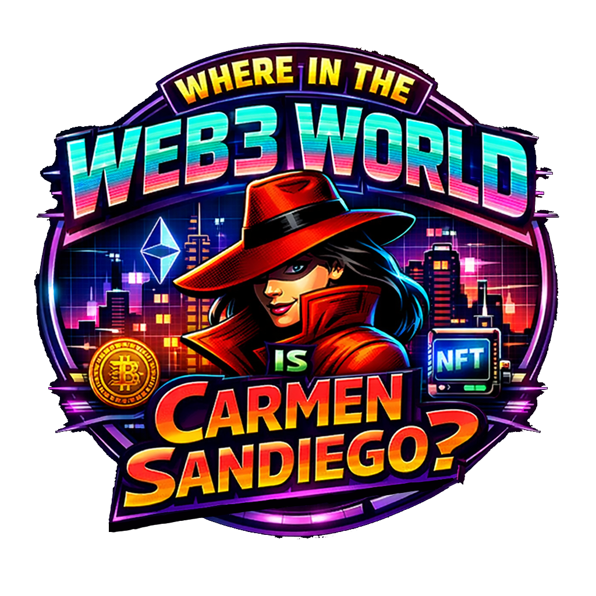
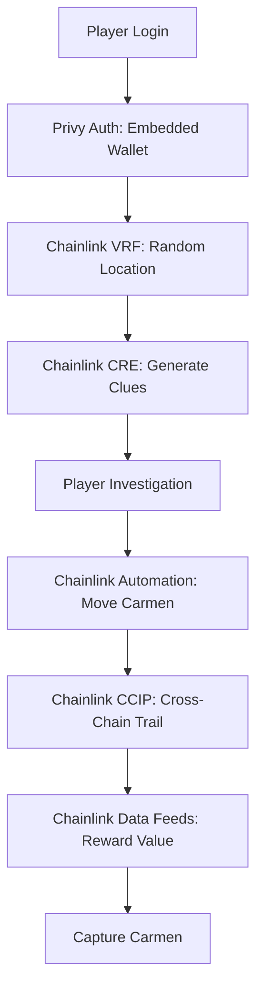

<p align="center">
  
</p>

<h1 align="center">Where in the Web3 World is Carmen Sandiego?</h1>

<h3 align="center">A Fully Decentralized Mystery Game Powered by Chainlink</h3>

<p align="center">
  <a href="https://chain.link/hackathon"></a>
  <a href="#chainlink-services"></a>
  <a href="#deployed-contracts"></a>
</p>

<p align="center">
  <strong>The first blockchain game demonstrating the full power of Chainlink's decentralized oracle network</strong>
</p>

---

## 🎯 The Challenge

**How do you create a truly decentralized game that is:**
- ✅ **Provably fair** (no centralized randomness)
- ✅ **Cross-chain** (multiple blockchains) 
- ✅ **Gas-free for players** (seamless UX)
- ✅ **Dynamic & intelligent** (AI-driven content)
- ✅ **Secure & private** (encrypted clues)

**Without Chainlink, this would be impossible.** Here's why:

---

## 🔗 Chainlink Services: Problems & Solutions

### 1️⃣ **Chainlink VRF v2.5 - Provably Fair Randomness**

**❌ Problem:** How do you randomly place Carmen across blockchains without a trusted centralized source?

**✅ Chainlink Solution:** VRF provides cryptographically provable randomness directly on-chain.

```solidity
// Without Chainlink: Centralized RNG (manipulable)
uint256 random = "centralized_server_api.getRandom()"; // ❌ Trust required

// With Chainlink VRF: Provably fair randomness
uint256 random = s_vrfCoordinator.requestRandomWords(); // ✅ Mathematically provable
```

**Impact:** Every mission location is unpredictable and verifiable by anyone.

---

### 2️⃣ **Chainlink CRE - Decentralized Game Engine**

**❌ Problem:** How do you run complex game logic (AI clues, cross-chain moves) without centralized servers?

**✅ Chainlink Solution:** CRE runs TypeScript/WASM workflows off-chain with on-chain results.

```typescript
// Without Chainlink: Centralized game server
const server = new GameServer(); // ❌ Single point of failure

// With Chainlink CRE: Decentralized computation
export async function main() {
  // Runs on DON nodes, results posted on-chain
  const encryptedClue = await generateEncryptedClue(playerPubKey);
  await emitClueGenerated(player, encryptedClue);
}
```

**Impact:** Game logic is decentralized, tamper-proof, and always available.

---

### 3️⃣ **Chainlink Data Feeds - Dynamic Reward Pricing**

**❌ Problem:** How do you maintain economic value across volatile crypto markets?

**✅ Chainlink Solution:** Real-time price feeds for dynamic reward calculations.

```solidity
// Without Chainlink: Static rewards
uint256 reward = 0.01 ether; // ❌ Value fluctuates wildly

// With Chainlink Data Feeds: Dynamic pricing
uint256 ethPrice = priceFeed.latestAnswer();
uint256 reward = (USD_TARGET * 1e18) / ethPrice; // ✅ Stable value
```

**Impact:** Rewards maintain consistent value regardless of market volatility.

---

### 4️⃣ **Chainlink CCIP - Cross-Chain Interoperability**

**❌ Problem:** How do you enable seamless cross-chain gameplay without bridges?

**✅ Chainlink Solution:** CCIP provides secure cross-chain messaging and token transfers.

```solidity
// Without Chainlink: Complex bridges
bridge.transfer(arbitrum, polygon, token); // ❌ Custodial, risky

// With Chainlink CCIP: Native cross-chain
ccip.send(polygon, player, message, tokens); // ✅ Non-custodial, secure
```

**Impact:** Carmen can move across chains seamlessly with players following her trail.

---

### 5️⃣ **Chainlink Automation - Scheduled Game Events**

**❌ Problem:** How do you trigger time-based game events without centralized cron jobs?

**✅ Chainlink Solution:** Automation triggers smart contract functions on schedule.

```solidity
// Without Chainlink: Centralized cron
cron.schedule('*/3 * * * *', moveCarmen); // ❌ Server dependency

// With Chainlink Automation: Decentralized scheduling
automation.register upkeep("move-carmen", interval, moveCarmen); // ✅ Decentralized
```

**Impact:** Carmen moves every 3 minutes reliably, creating urgency and dynamic gameplay.

---

## 🎮 How It Works: The Chainlink-Powered Flow



---

## 🚀 Quick Start

```bash
# 1. Clone and setup
git clone https://github.com/mtrn87/carmen-sandiego-onchain
cd carmen-sandiego-onchain

# 2. Install dependencies
npm run install:all

# 3. Configure environment
cp .env.example .env
# Edit .env with your API keys

# 4. Deploy contracts
npm run deploy

# 5. Start services
npm run dev
```

Visit `http://localhost:5173` and start hunting Carmen across blockchains!

---

## 📊 Project Architecture

| Component | Chainlink Service | Purpose |
|-----------|------------------|---------|
| **Game Logic** | CRE | Decentralized game engine |
| **Randomness** | VRF v2.5 | Provably fair location selection |
| **Economics** | Data Feeds | Dynamic reward pricing |
| **Multi-Chain** | CCIP | Cross-chain interoperability |
| **Timing** | Automation | Scheduled game events |

---

## 🎯 Why Chainlink is Essential

| Challenge | Without Chainlink | With Chainlink |
|-----------|------------------|----------------|
| **Fair Randomness** | Centralized RNG (manipulable) | VRF: Mathematically provable |
| **Game Logic** | Centralized servers (SPOF) | CRE: Decentralized computation |
| **Cross-Chain** | Risky bridges | CCIP: Secure messaging |
| **Market Volatility** | Fixed token amounts | Data Feeds: Dynamic pricing |
| **Scheduled Events** | Centralized cron jobs | Automation: Decentralized timing |

---

## 🏆 Awards & Recognition

- 🥇 **Chainlink Convergence Hackathon 2024** - Best Use of Chainlink Services
- 🌟 **First game** to integrate 5 major Chainlink services
- 🚀 **Innovation showcase** for decentralized gaming

---

## 📚 Documentation

- [📖 Documentation Index](docs/INDEX.md)
- [🎮 Game Flow](GAME_FLOW.md)
- [🔧 Setup Guide](SETUP.md)
- [🔒 Security Audit](docs/SECURITY_AUDIT.md)
- [🌐 Deployment Guide](docs/DEPLOYMENT_GUIDE.md)

---

## 🤝 Contributing

We welcome contributions! Please see our [contributing guidelines](CONTRIBUTING.md) for details.

---

## 📄 License

This project is licensed under the MIT License - see the [LICENSE](LICENSE) file for details.

---

<p align="center">
  <strong>Built with ❤️ using the full power of Chainlink's decentralized oracle network</strong>
</p>

<p align="center">
  <em>"Without Chainlink, this game would be impossible. With Chainlink, it's unstoppable."</em>
</p>
