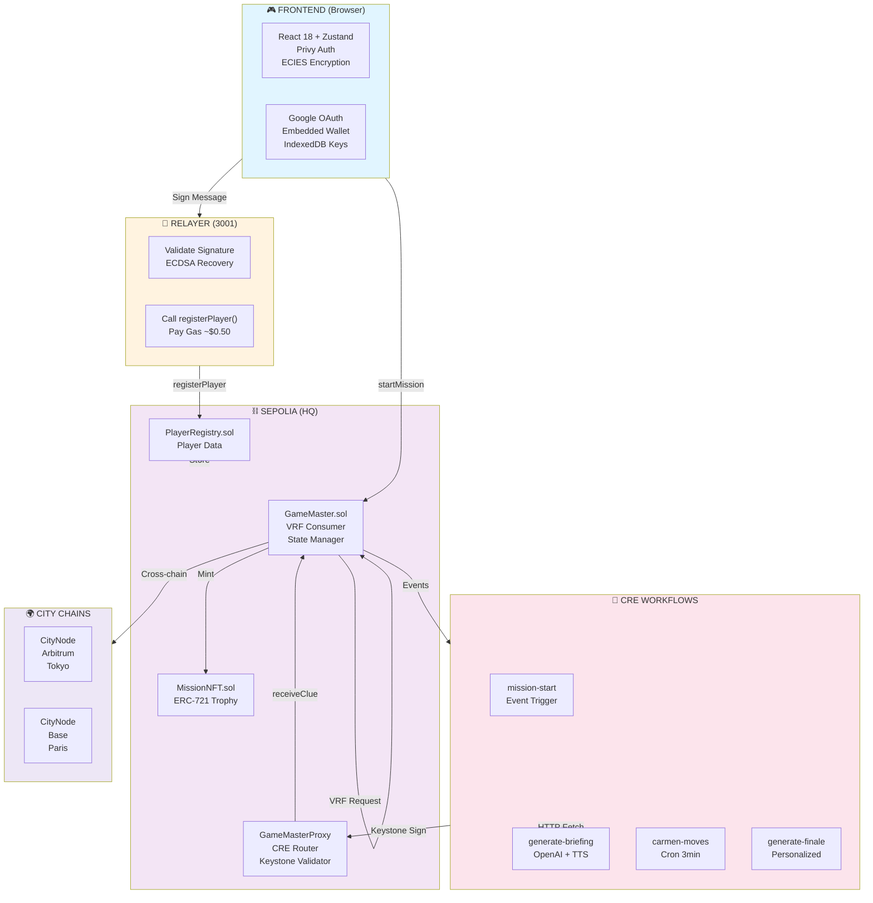

# Arquitetura — Carmen Sandiego On-Chain

## Visão Geral



---

## Contratos (Sepolia)

| Contrato | Endereço | Função |
|----------|----------|--------|
| GameMaster | `0xB6E2A9DEd3352E1a1B4a501c6F110813883F4cEB` | Engine: missões, commit-reveal, VRF |
| GameMasterProxy | `0x1Ced414A8eb7bbfc7d070259741Ee291a6c61fcb` | Recebe reports CRE → roteia para GameMaster |
| MissionNFT | `0xEaa76403a4d1448Df21946e886Cd4583a8bD580b` | ERC-721 troféu por missão |

### Herança

```
VRFConsumerBaseV2Plus → GameMaster (implements IGameMaster)
Ownable → ReceiverTemplate → GameMasterProxy
ERC721 + ERC721URIStorage → MissionNFT (implements IMissionNFT)
ICityNode → CityNode (per-chain)
```

### Funções Principais — GameMaster

| Função | Visibilidade | Quem chama |
|--------|-------------|------------|
| `registerPlayer(bytes pubKey)` | external | Jogador |
| `startMission()` | external | Jogador |
| `submitInvestigation(uint256 chainId)` | external | Jogador |
| `receiveClue(missionId, type, hash, ptr)` | external (onlyCRE) | Proxy |
| `resolveCapture(missionId, chainId, salt)` | external (onlyCRE) | Proxy |
| `updateTarget(missionId, newHash)` | external (onlyCRE) | Proxy |
| `fulfillRandomWords(reqId, words)` | internal | VRF Coordinator |
| `getMission/Salt/Clues/PublicKey/Cities` | view | CRE + Frontend |

### Eventos

```
PlayerRegistered(player, publicKey)
MissionStarted(missionId, player, startBlock)
CarmenLocationCommitted(missionId, targetHash)
InvestigationSubmitted(missionId, player, chainId)    ← CRE trigger
ClueReceived(missionId, clueType, contentHash, ipfsPointer)
CarmenCaptured(missionId, player, blocksUsed, reward)
CarmenMoved(missionId, newTargetHash)
MissionFailed(missionId, player)
MissionNFTMinted(tokenId, missionId, player, reward)
```

---

## Fluxo do Jogo

```
1. registerPlayer(publicKey)     → Jogador registra chave ECIES
2. startMission()                → VRF gera randomness
3. fulfillRandomWords()          → COMMIT: targetHash = keccak256(chainId, salt)
                                   salt = keccak256(vrfWord, missionId)
4. submitInvestigation(chainId)  → Jogador escolhe cidade
   ↓ emit InvestigationSubmitted
5. CRE mission-start:
   a. EVMRead: salt, cidades, targetHash, playerPubKey
   b. Brute-force: testa keccak256(city, salt) para cada cidade
   c. isCorrect = (chainId investigado == cidade da Carmen)
   d. Seleciona clue do scenarios.json (true/false pool)
   e. ECIES encrypt(playerPubKey, clueText)
   f. writeReport → ACTION=1 → receiveClue(encrypted)
   g. Se correto + ≥3 clues → ACTION=2 → resolveCapture()
6. resolveCapture(chainId, salt) → REVEAL: verifica hash, minta NFT
```

### Carmen Moves (Cron)
```
Cada 3 min → carmen-moves workflow
  → Lê mission ativa, brute-force cidade atual
  → Escolhe nova cidade, calcula novo targetHash
  → writeReport → ACTION=3 → updateTarget(newHash)
```

---

## ECIES Encryption

```
CRE (mission-start/ecies.ts):
  plaintext → ECDH(ephemeral + playerPubKey) → HKDF → AES-256-GCM → hex

Formato ciphertext:
  ephemeralPubKey(65) || iv(12) || ciphertext || tag(16) = 93 + n bytes

Frontend (utils/ecies.js):
  hex → ECDH(privKey + ephemeralPubKey) → HKDF → AES-256-GCM → plaintext
  Private key: IndexedDB ("carmen-sandiego" → "keys" → "ecies-keypair")

Libs: @noble/curves@1.8.2, @noble/ciphers@1.2.1, @noble/hashes@1.7.2
⚠️ v2.x quebra WASM do CRE — usar v1.x
```

---

## Frontend (Estado Atual)

| Camada | Status | Detalhe |
|--------|--------|---------|
| Auth (Privy) | Funcional | Google + MetaMask, session persist em localStorage |
| gameStore.js | **100% Mock** | Dados hardcoded, setTimeout simula blockchain |
| contractData.js | **100% Mock** | Transações/eventos falsos |
| ecies.js | Pronto | Decrypt + IndexedDB key storage implementados |
| UI Components | Prontos | ContractExplorer, InteractiveMap, TerminalSidebar |

**Gap principal**: Zero chamadas reais a contratos. gameStore usa `MOCK_CLUES`, `LOCATIONS` hardcoded, e `generateClueText()` local.

### Estrutura de Componentes
```
App.jsx (router)
├── LoginPage.jsx (Privy auth + nickname)
└── GamePage.jsx
    ├── MissionBriefing.jsx (cinematic overlay)
    ├── TerminalSidebar.jsx (terminal + evidence + chat)
    └── Main area
        ├── ContractExplorer.jsx (tx explorer)
        └── InteractiveMap.jsx (world map canvas)
```

---

## Testes

- **65 testes** (Hardhat) — todos passando
- CRE: 3 workflows compilam WASM + simulam com sucesso

---

## O que falta (próximos passos)

1. **Frontend ↔ Contratos** — substituir mock por chamadas ethers.js reais
2. **CRE Deploy** — aguardando early access Chainlink
3. **CityNode deploy** — Arbitrum Sepolia, Base Sepolia, XDC Apothem
4. **CCIP** — cross-chain messaging (não implementado ainda)
5. **AI Integration** — Gemini/OpenAI para clues dinâmicas (prompts.ts pronto)
