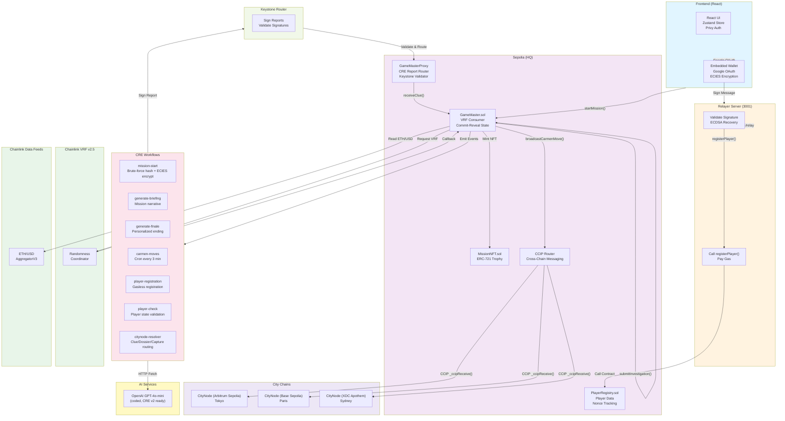
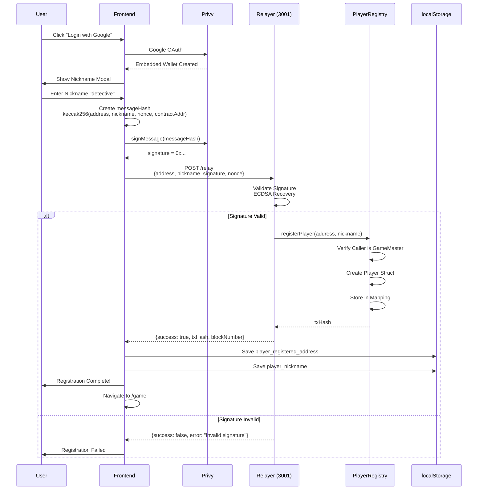
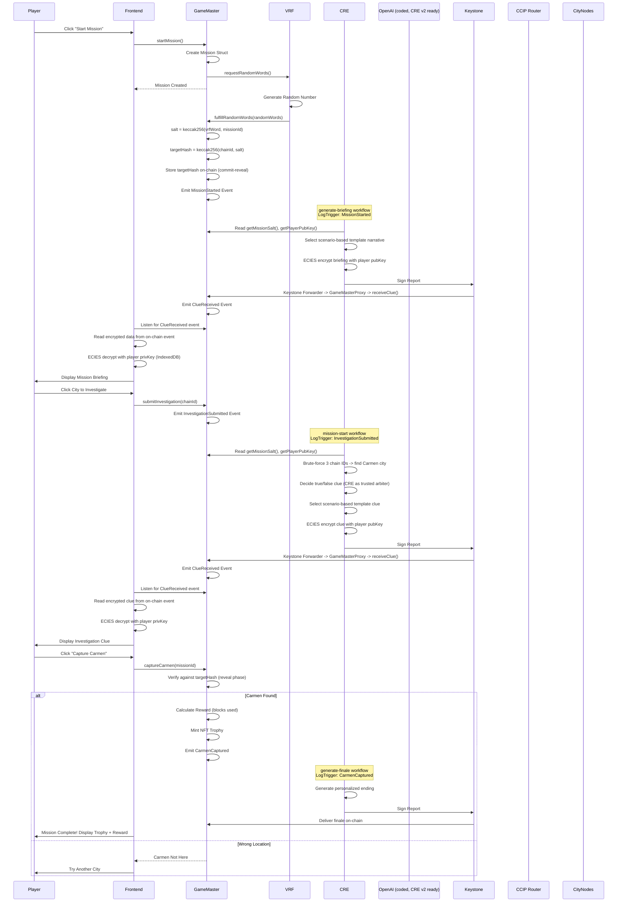
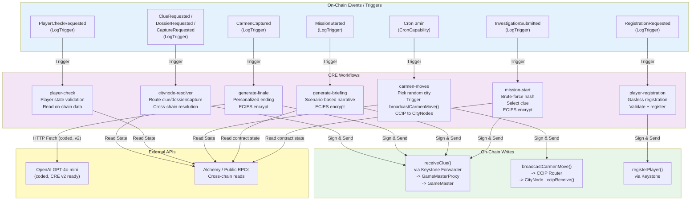
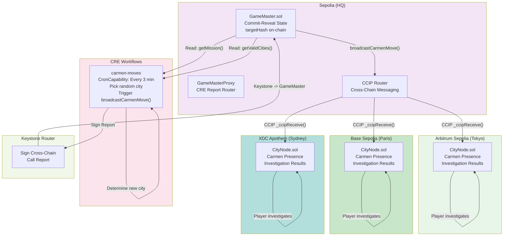
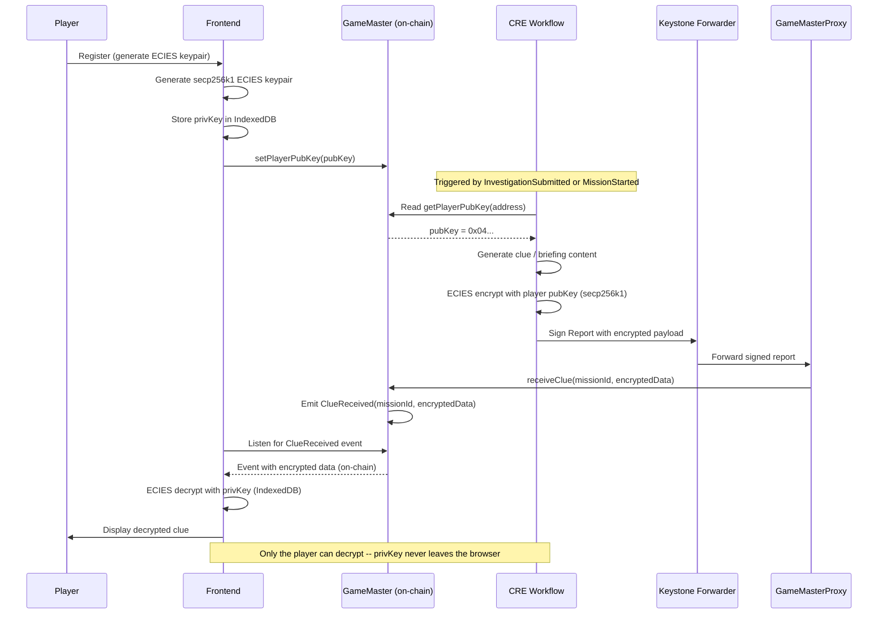
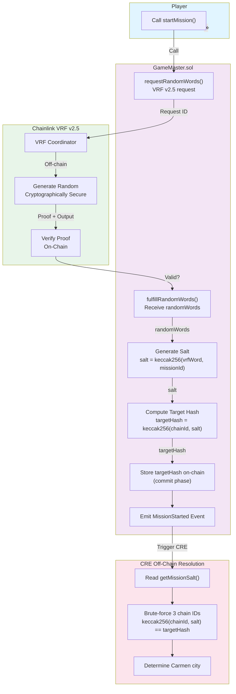
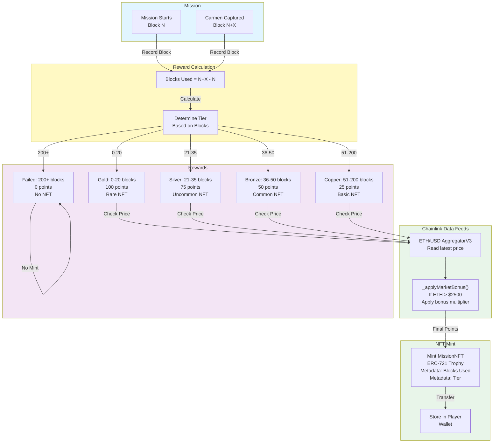

# System Diagrams — Carmen Sandiego On-Chain

Visual representations of system architecture, data flows, and gameplay mechanics.

---

## 1. System Architecture Diagram

---

## 2. Gasless Registration Flow

---

## 3. Gameplay Flow

---

## 4. CRE Workflow Orchestration

---

## 5. Multi-Chain Interaction

---

## 6. Data Encryption Flow

---

## 7. VRF Randomness Flow

---

## 8. Reward System Flow

---

**Last Updated:** March 2026
