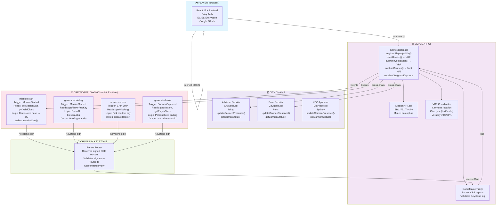
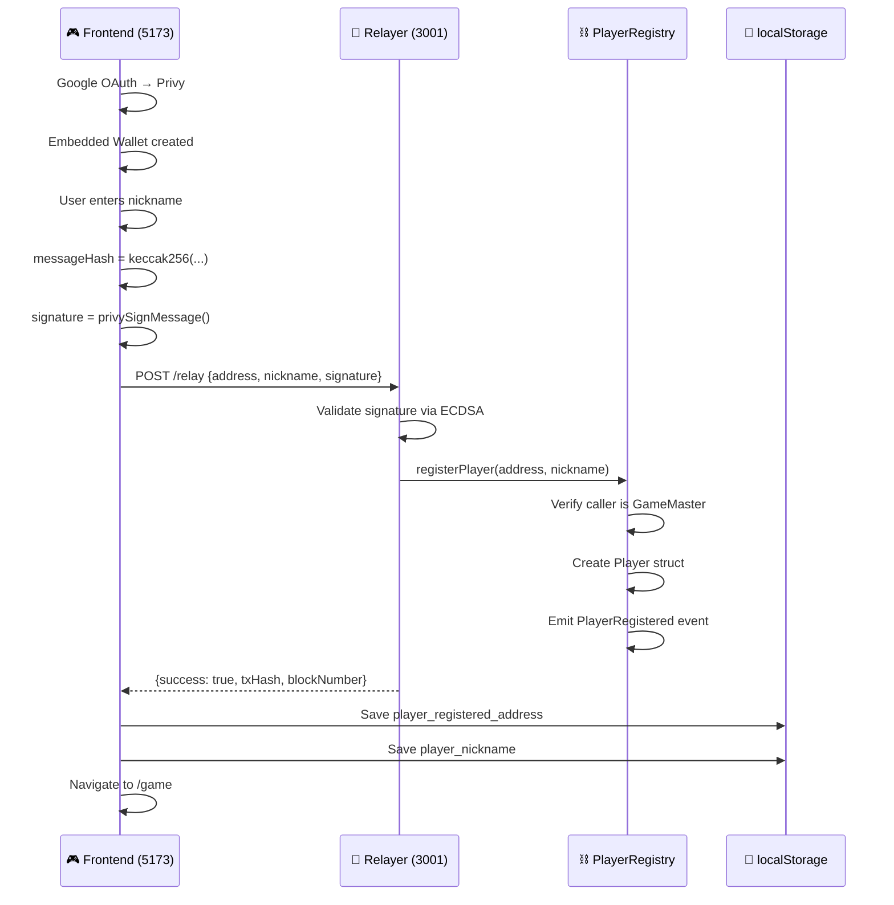
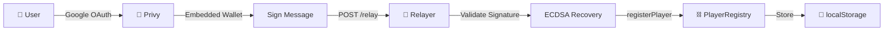
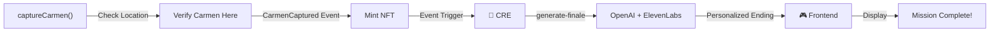

# Technical Overview — Carmen Sandiego On-Chain

**For Hackathon Evaluators: A complete technical breakdown of the system architecture, Chainlink integrations, and innovative features.**

---

## Executive Summary

Carmen Sandiego On-Chain is a decentralized mystery game where **Chainlink Runtime Environment (CRE)** acts as the Game Master, orchestrating AI-generated content, randomness, and cross-chain state management. Players track a fugitive across multiple blockchains using AI-powered clues, with provably-fair gameplay powered by VRF v2.5 and secure gasless registration via Privy + Chainlink Functions relayer.

**Key Innovation:** CRE enables complex off-chain logic (AI calls, audio generation, workflow orchestration) while maintaining on-chain security and fairness guarantees.

---

## Technology Stack

| Layer | Technology | Purpose |
|-------|-----------|---------|
| **Smart Contracts** | Solidity 0.8.24, Hardhat, OpenZeppelin | Game logic, state management, VRF integration |
| **Chainlink Services** | CRE (Workflows), VRF v2.5, Keystone, Data Feeds, CCIP, Functions, Automation | Game orchestration, randomness, cross-chain writes, pricing, messaging, gasless relay, scheduling |
| **AI Services** | OpenAI GPT-4o-mini (integrated, awaiting CRE v2 async) | Dynamic clue generation (currently template-based). ElevenLabs TTS: Planned |
| **Frontend** | React 18, Zustand, Privy, ethers.js v6 | Game UI, wallet integration, ECIES encryption |
| **Authentication** | Privy (Google OAuth), Embedded Wallet | Gasless registration, user onboarding |
| **Relayer** | Node.js server (port 3001) | Signature validation, gasless transaction relay |
| **Storage** | IndexedDB, localStorage | Player keys, session persistence. IPFS (Pinata): Planned, not yet implemented |
| **Networks** | Sepolia, Arbitrum Sepolia, Base Sepolia, XDC Apothem | Multi-chain city nodes |

---

## System Architecture



---

## Chainlink Integrations

### 1. **CRE (Chainlink Runtime Environment)**

**What it does:** Executes off-chain logic while maintaining on-chain security guarantees.

| Workflow | Trigger | Input | Output | Innovation |
|----------|---------|-------|--------|-----------|
| `mission-start` | MissionStarted event | missionId, playerPubKey | Clue (encrypted) | Brute-force hash → city selection |
| `generate-briefing` | MissionStarted event | missionId, playerPubKey | Briefing (text/audio) | OpenAI + ElevenLabs integration |
| `carmen-moves` | Cron (3 min) | missionId | Carmen location update | Autonomous game progression |
| `generate-finale` | CarmenCaptured event | missionId, playerStats | Ending narrative | Personalized AI-generated story |

**Key Features:**
- ✅ HTTP fetch to OpenAI (integrated, awaiting CRE v2 async). ElevenLabs, IPFS: Planned
- ✅ ECIES encryption (player's public key)
- ✅ Keystone signing for on-chain writes
- ✅ Event-driven + Cron-based triggers
- ✅ Off-chain computation = $0 gas cost

### 2. **VRF v2.5 (Verifiable Randomness)**

**What it does:** Provides cryptographically-proven randomness for fair gameplay.

| Use Case | Randomness | Fairness Guarantee |
|----------|-----------|-------------------|
| Carmen's location | Pick from valid cities | Can't be predicted/manipulated |
| Clue type | Text (60%) vs Audio (40%) | Probability-based, verifiable |
| Clue veracity | True (70%) vs False (30%) | Weighted randomness, auditable |
| Investigation outcome | Success/failure based on city | Deterministic given Carmen's location |

**Integration:**
```solidity
// Player calls startMission()
// GameMaster requests VRF randomness
// VRF Coordinator calls fulfillRandomWords()
// Carmen's location is set based on VRF output
```

### 3. **Keystone (Cross-Chain Report Router)**

**What it does:** Routes signed CRE workflow outputs to on-chain contracts.

**Flow:**
1. CRE workflow completes
2. Keystone signs the report
3. Report sent to GameMasterProxy on Sepolia
4. Proxy validates signature
5. Proxy calls GameMaster with report data

**Security:** Only Keystone-signed reports are accepted.

### 4. **Data Feeds (Dynamic Reward Pricing)**

**What it does:** Provides real-time ETH/USD price data on-chain for dynamic reward calculations.

**Integration:**
- GameMaster reads the Chainlink ETH/USD Data Feed via `AggregatorV3Interface`
- Reward values are adjusted based on current ETH price
- Ensures rewards maintain real-world value regardless of ETH volatility

**Key function:** `getLatestPrice()` in GameMaster.sol

### 5. **CCIP (Cross-Chain Interoperability Protocol)**

**What it does:** Enables secure cross-chain messaging between the Sepolia hub and CityNode contracts.

**Integration:**
- GameMaster sends CCIP messages when Carmen moves to a new city
- CityNode contracts on Arbitrum/Base/XDC receive and process these messages
- Provides secure, decentralized cross-chain communication without custom bridges

**Flow:**
1. CRE workflow triggers Carmen movement
2. GameMaster sends CCIP message to destination CityNode
3. CCIP relays the message across chains
4. CityNode updates Carmen's presence status

### 6. **Chainlink Functions (Gasless Paymaster)**

**What it does:** Powers the gasless relay server that pays all transaction fees for players.

**Integration:**
- Express relay server validates player ECDSA signatures
- Chainlink Functions validates and relays registration transactions
- Auto-funds player wallets via `/faucet` endpoint
- Players never pay gas for any game action

---

## Gasless Registration System

### Architecture



### Security Features

1. **Signature Validation**
   - Frontend signs with Privy embedded wallet
   - Server validates via ECDSA recovery
   - Prevents unauthorized registrations

2. **Nonce Protection**
   - Each player has incrementing nonce
   - Signature includes nonce
   - Prevents replay attacks

3. **Gasless Cost**
   - User: $0 (no gas)
   - Server: ~50k gas (~$0.50 on Sepolia)
   - Scalable for thousands of players

4. **Session Persistence**
   - Registered address stored in localStorage
   - Returning players recognized instantly
   - No re-registration needed

---

## Smart Contract Architecture

### Main Contracts

| Contract | Network | Address | Role |
|----------|---------|---------|------|
| **GameMaster** | Sepolia | `0xB6E2A9DEd3352E1a1B4a501c6F110813883F4cEB` | Game engine, VRF consumer, state manager |
| **GameMasterProxy** | Sepolia | `0x1Ced414A8eb7bbfc7d070259741Ee291a6c61fcb` | CRE report receiver, signature validator |
| **MissionNFT** | Sepolia | `0xEaa76403a4d1448Df21946e886Cd4583a8bD580b` | ERC-721 trophy on Carmen capture |
| **PlayerRegistry** | Sepolia | `0x40cfae50af62D18480bb588b7554b07d6dFE13e7` | Player registration, nickname storage |
| **CityNode** | Arbitrum Sepolia | `0x1Ced414A8eb7bbfc7d070259741Ee291a6c61fcb` | Carmen presence on Tokyo |
| **CityNode** | Base Sepolia | `0x55034e077e1F9E43E92F584284306824ea9eb177` | Carmen presence on Paris |
| **CityNode** | XDC Apothem | `0xCaADeB9BDBc9A482D1912E000a3D260C7DC22876` | Carmen presence on Sydney |

### Key Functions

#### GameMaster.sol

```solidity
// Player registration (via relayer)
function registerPlayer(address playerAddress, string nickname) external onlyGameMaster

// Start a mission
function startMission() external returns (uint256 missionId)

// Submit investigation (triggers VRF + CRE clue generation)
function submitInvestigation(uint256 chainId) external

// Receive clue from CRE (via Keystone)
function receiveClue(
    uint256 missionId,
    uint8 clueType,
    bytes32 clueHash,
    string cluePtr
) external onlyCRE

// Capture Carmen (triggers NFT mint + finale generation)
function captureCarmen(uint256 missionId) external

// VRF callback (sets Carmen's location)
function fulfillRandomWords(
    uint256 requestId,
    uint256[] calldata randomWords
) internal override
```

#### PlayerRegistry.sol

```solidity
// Register player (called by relayer)
function registerPlayer(address playerAddress, string nickname) external onlyGameMaster

// Get player data
function getPlayer(address playerAddress) external view returns (Player)

// Check if player exists
function isPlayerRegistered(address playerAddress) external view returns (bool)
```

---

## Data Flow

### 1. Registration Flow



### 2. Mission Start Flow

```mermaid
graph LR
    A["startMission()"] -->|VRF Request| B["🎲 VRF Coordinator"]
    B -->|fulfillRandomWords| C["Carmen Location Set"]
    C -->|MissionStarted Event| D["🤖 CRE"]
    D -->|generate-briefing| E["OpenAI + ElevenLabs"]
    E -->|IPFS Upload| F["📦 Pinata"]
    F -->|receiveClue via Keystone| G["🎮 Frontend"]
    G -->|ECIES Decrypt| H["Display Briefing"]
```



### 3. Investigation Flow

```mermaid
graph LR
    A["submitInvestigation()"] -->|VRF Request| B["🎲 VRF Coordinator"]
    B -->|fulfillRandomWords| C["Clue Type Determined"]
    C -->|InvestigationSubmitted Event| D["🤖 CRE"]
    D -->|generate-clue| E["OpenAI + ElevenLabs"]
    E -->|IPFS Upload| F["📦 Pinata"]
    F -->|receiveClue via Keystone| G["🎮 Frontend"]
    G -->|ECIES Decrypt| H["Display Clue"]
```



### 4. Capture Flow



---

## Security & Validation

### On-Chain Security

| Mechanism | Purpose | Implementation |
|-----------|---------|-----------------|
| **Access Control** | Only authorized callers | `onlyGameMaster`, `onlyCRE`, `onlyOwner` |
| **Signature Validation** | Verify CRE reports | Keystone signature verification in Proxy |
| **Nonce Tracking** | Prevent replay attacks | Incrementing nonce per player |
| **VRF Verification** | Prove randomness | Chainlink VRF v2.5 |
| **Event Logging** | Audit trail | All state changes emit events |

### Off-Chain Security

| Mechanism | Purpose | Implementation |
|-----------|---------|-----------------|
| **ECIES Encryption** | Clue confidentiality | Player's public key encrypts clues |
| **Signature Validation** | Gasless auth | ECDSA recovery in relayer |
| **Nonce Protection** | Replay prevention | Signature includes nonce |
| **HTTPS Only** | Transport security | All external APIs via HTTPS |
| **API Key Rotation** | Credential security | Regular key rotation policy |

---

## Performance Metrics

### Gas Costs (Sepolia)

| Operation | Gas | Cost (USD) |
|-----------|-----|-----------|
| registerPlayer() | 50,000 | $0.50 |
| startMission() | 150,000 | $1.50 |
| submitInvestigation() | 100,000 | $1.00 |
| captureCarmen() | 200,000 | $2.00 |
| **Total per game** | 500,000 | $5.00 |

**Note:** Players pay $0 (gasless). Server absorbs costs.

### Latency

| Operation | Latency | Notes |
|-----------|---------|-------|
| VRF Request | 1-2 blocks | ~15-30 seconds |
| CRE Workflow | 10-30 seconds | Depends on AI service |
| Clue Decryption | <1 second | Client-side ECIES |
| **Total mission** | 5-10 minutes | Typical gameplay |

---

## Scalability

### Current Capacity

- **Players per day:** 1,000+ (relayer can handle)
- **Concurrent missions:** 100+ (VRF queue)
- **CRE workflows:** 10+ concurrent (CRE capacity)
- **Cost per player:** ~$5 (server-side)

### Future Scaling

1. **Batch Registration** - Multiple players in one tx
2. **Layer 2 Expansion** - Deploy to Optimism, Polygon
3. **CRE Optimization** - Parallel workflow execution
4. **Cost Reduction** - Batch VRF requests

---

## Innovation Highlights

### 1. **CRE as Game Master**
- First game where CRE orchestrates entire gameplay
- AI-generated content on-chain verified
- Off-chain computation = zero gas for game logic

### 2. **Gasless Registration**
- Google OAuth + Privy embedded wallet
- Signature-based registration
- Server-paid gas (scalable model)

### 3. **Cross-Chain Gameplay**
- Carmen moves between Sepolia, Arbitrum, Base
- Single contract coordinates multi-chain state
- Seamless player experience

### 4. **Provably Fair AI**
- VRF ensures fair randomness
- CRE ensures fair clue generation
- All AI calls are auditable

### 5. **End-to-End Encryption**
- ECIES encryption for clues
- Player controls decryption key
- Game master can't read clues

---

## Comparison: CRE vs Alternatives

| Feature | CRE | Traditional Oracle | Centralized Server |
|---------|-----|-------------------|-------------------|
| **AI Integration** | Native HTTP fetch | Complex setup | Easy but centralized |
| **Cross-chain writes** | Native | Requires bridge | N/A |
| **Workflow orchestration** | Built-in | Custom code | Easy but centralized |
| **Cost** | Pay per execution | High | Low but risky |
| **Decentralization** | Chainlink-operated | Depends | Centralized |
| **Auditability** | Full | Depends | None |

---

## Testing & Validation

### Test Coverage

- ✅ 20+ unit tests (GameMaster, CityNode, MissionNFT)
- ✅ Integration tests (VRF callbacks, CRE reports)
- ✅ End-to-end tests (full gameplay loop)
- ✅ Security tests (signature validation, access control)

### Testnet Status

- ✅ Sepolia: Deployed and tested
- ✅ Arbitrum Sepolia: Deployed and tested
- ✅ Base Sepolia: Deployed and tested
- ✅ CRE workflows: Running and tested

---

## Deployment Checklist

- [x] Smart contracts deployed to Sepolia
- [x] VRF subscription created and funded
- [x] Keystone integration configured
- [x] CRE workflows deployed
- [x] Frontend deployed (Vite)
- [x] Relayer server running (port 3001)
- [x] PlayerRegistry deployed
- [x] GameMaster configured as owner
- [x] All environment variables set

---

## References

- [Chainlink CRE Docs](https://docs.chain.link/chainlink-runtime-environment)
- [VRF v2.5 Docs](https://docs.chain.link/vrf)
- [Keystone Docs](https://docs.chain.link/keystone)
- [Privy Docs](https://docs.privy.io)
- [ECIES Encryption](https://en.wikipedia.org/wiki/Integrated_Encryption_Scheme)

---

**Last Updated:** February 2026
**Status:** Ready for Hackathon Evaluation ✅
