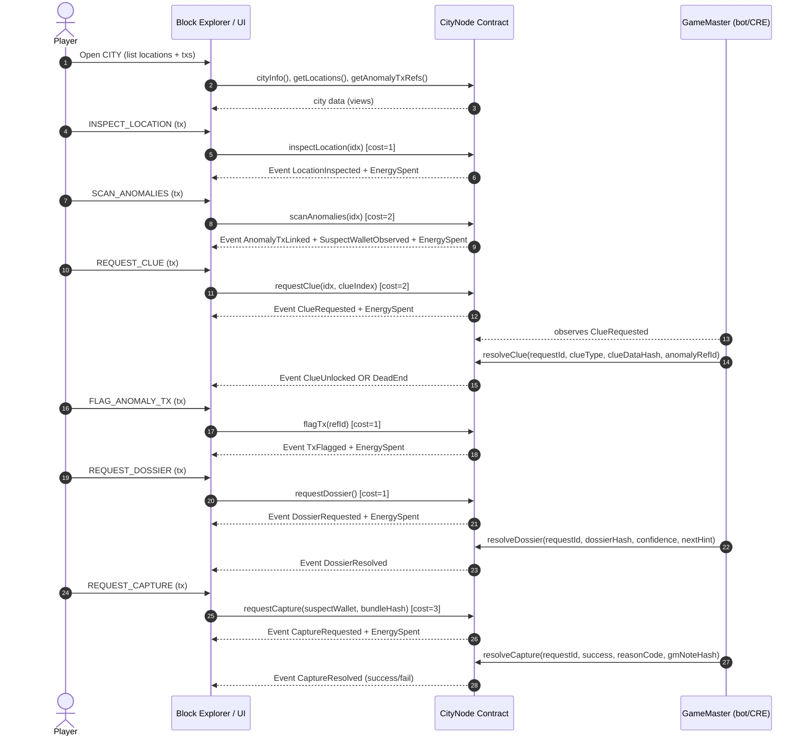

# Carmen Sandiego On-Chain - Gameplay Loop

## Overview

The gameplay loop follows a detective investigation pattern where players explore cities, investigate locations on-chain, collect clues about a suspect wallet, and attempt to capture Carmen by identifying the correct address.

## Game Flow



## Macro Loop

```
Access City
  |
  v
Access Location (1 of 3 per city)
  |
  v
View location info (description, category, risk)
  |
  v
Investigate on blockchain (inspect -> scan -> request clue)
  |
  v
Receive clue (intensity 0=dead end to 3=strong identity commit)
  |
  v
Consult Dossier if needed (organizes evidence, suggests next step)
  |
  v
Identify wallet pattern from clues
  |
  v
Enter Capture Mode (dark overlay, wallets only)
  |
  v
Attempt arrest on suspect wallet
  |
  v
GameMaster validates -> success or failure with reason
```

## Actions and Energy Costs

| Action | Energy Cost | Prerequisite | Description |
|--------|------------|--------------|-------------|
| `inspectLocation(idx)` | 1 | City configured | Marks location as inspected, emits note |
| `scanAnomalies(idx)` | 2 | Location inspected | Reveals anomaly txs and suspect wallets |
| `requestClue(idx, clueIndex)` | 2 | Location scanned | Requests a clue (resolved by GM) |
| `flagTx(refId)` | 1 | None | Flags a suspicious transaction as evidence |
| `requestDossier()` | 1 | None | Requests evidence summary from GM |
| `requestCapture(wallet, hash)` | 3 | Valid wallet + evidence | Attempts to arrest suspect wallet |

### Energy System

- **MAX_ENERGY**: 10
- **Regen**: +1 every 15 minutes (cap at 10)
- **Initial**: All players start with 10 energy
- Energy is tracked per player per CityNode contract
- Regen is calculated passively (no tx needed for regen)

### Action Gating (Enforced Sequence)

```
inspectLocation(idx) -> unlocks scanAnomalies(idx)
scanAnomalies(idx)   -> unlocks requestClue(idx, clueIndex)
```

Progress tracked via bitmaps: `inspectedBitmap` and `scannedBitmap` (bit per location).

## Clue Types

| Type | Enum Value | Description | Strength |
|------|-----------|-------------|----------|
| BEHAVIOR_FINGERPRINT | 0 | Gas/timing/value patterns | Low-Medium |
| RELATIONSHIP | 1 | Counterparty interactions | Medium |
| IDENTITY_COMMIT | 2 | Hash of suspect address | High |
| FUNDING_TRAIL | 3 | Funding source patterns | Medium |
| TECHNICAL_SIGNATURE | 4 | CREATE2/proxy patterns | Medium-High |
| DEAD_END | 5 | No clue (with consolation hint) | None |

### Recommended Clue Distribution Per City

**Real trail city (Carmen was here):**
- Clue #1: BEHAVIOR_FINGERPRINT (broad, non-spoiler)
- Clue #2: RELATIONSHIP (medium, counterparty reveal)
- Clue #3: IDENTITY_COMMIT (strong, nearly resolves)

**Fake city (red herring):**
- DeadEnd with consolation hint pointing to another city
- Negation hints ("not a smart wallet", "doesn't use Router X")

## Anomaly Types

| Type | Enum Value | Description |
|------|-----------|-------------|
| UNUSUAL_GAS | 0 | Gas price in unusual multiples |
| BURST_NONCE | 1 | Rapid sequential transactions |
| PRECISE_VALUE | 2 | Values with specific patterns |
| RECURRING_COUNTERPARTY | 3 | Same address interactions |
| BRIDGE_USAGE | 4 | Cross-chain bridge activity |
| CREATE2_DEPLOY | 5 | Deterministic contract deployment |

## Capture Flow

### Capture Reason Codes

| Code | Enum Value | Meaning |
|------|-----------|---------|
| OK | 0 | Capture successful |
| INSUFFICIENT_EVIDENCE | 1 | Not enough clues collected |
| WALLET_MISMATCH | 2 | Wrong wallet selected |
| WRONG_CITY | 3 | Trail not in this city |
| EXPIRED_REQUEST | 4 | Request timed out |
| INVALID_BUNDLE | 5 | Evidence bundle invalid |

### Anti-Spoiler: Identity Commits

Carmen's wallet is never stored in plaintext on-chain. Instead:
- Each real clue emits `IDENTITY_COMMIT` with `keccak256(suspectWallet, caseSalt)`
- Player submits `requestCapture(suspectWallet, evidenceBundleHash)`
- GameMaster validates off-chain by comparing commits
- Contract only records the boolean result

## UI Layout

### City View (Block Explorer)
- **Overview tab**: City info, suspicion level, 3 locations
- **Contracts tab**: Investigation methods (inspect, scan, requestClue, flagTx)
- **Evidence tab**: Collected clues, flagged txs, suspect wallets, DOSSIER button

### Terminal (bottom panel)
- Real-time event stream with colored lines
- CAPTURE button below terminal output

### Capture Mode (overlay)
- Full-screen dark overlay
- Only shows: suspect wallets + search + confidence
- Click wallet -> modal -> Attempt Capture button
- States: READY -> PENDING -> SUCCESS/FAIL

### Terminal Event Format

```
> INSPECT: Dubai Mall
Energy -1 (9/10)
NOTE: crowd pattern unusual...

> REQUEST CLUE 2/3: Burj Khalifa
Energy -2 (7/10)
PENDING GM...

> GM RESOLVED: CLUE #2 (RELATIONSHIP)
HIT: interacts with FeeSink_0xB3..
ANOMALY: ref#A9F2

> FLAG TX ref#A9F2
Energy -1 (6/10)
STATUS: evidence pinned

> CAPTURE MODE ENABLED
> LIST SUSPECTS: 6 wallets
> SELECT 0xABCD...1234
> REQUEST CAPTURE SENT (#104)
> GM VERDICT: FAIL (INSUFFICIENT_EVIDENCE)
> NOTE: "Need 1 more identity trace from a port-related location."
```

## Contract Architecture

```
Per City Chain (Arbitrum/Base/XDC)
+---------------------------+
|       CityNode            |
|  - 3 LocationInfo slots   |
|  - Anomaly TxRef pool     |
|  - Suspect wallet pool    |
|  - Energy system          |
|  - Player progress bitmap |
|  - Request/resolve cycle  |
+---------------------------+
         |
         | onlyGameMaster
         v
+---------------------------+
|      GameMaster           |
|  (Sepolia - source truth) |
|  - VRF randomness         |
|  - Commit-reveal          |
|  - CRE integration        |
|  - Cross-city progress    |
|  - Resolve callbacks      |
+---------------------------+
```
